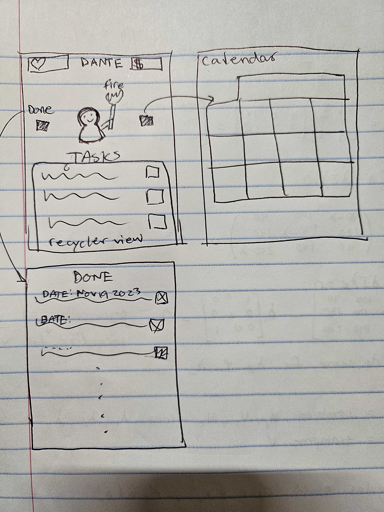

# **PENDING APP NAME (TBD)**

## Table of Contents

1. [App Overview](#App-Overview)
1. [Product Spec](#Product-Spec)
1. [Wireframes](#Wireframes)
1. [Build Notes](#Build-Notes)

## App Overview

### Description 

**Mobile app that gamifies task management by allowing users to schedule tasks, earn points, and level up their virtual avatars.**

### App Evaluation

<!-- Evaluation of your app across the following attributes -->

- **Category:** Productivity, Gamification
- **Mobile:** Users interact with their avatars, earning rewards and customizing features. Push notifications keep users engaged and on track.
- **Story:** Tasks become adventures as users strive to level up their avatars and unlock rewards, creating a compelling narrative of progress.
- **Market:** The app caters to a broad user base interested in enhancing productivity through gamified elements, primarily young adults. 
- **Habit:** Users integrate the app into their daily routine, constantly striving to complete tasks and earn rewards. The app encourages frequent engagement as users progress through levels and unlock new features.
- **Scope:** 
    - **V1**: Users schedule tasks and earn points with their virtual avatars. 
    - **V2**: Introduces advanced gamification elements, such as challenges and leaderboards. 
    - **V3**: (Optional) Enhances social features, allowing users to compete and collaborate with friends.
    - **V4**: (Optional) Expands platform compatibility and introduces premium customization options.

## Product Spec

### 1. User Features (Required and Optional)

Required Features:

- **Using Google Calendar API**
- **At least 3 Screens**
- **Themes**
- **Connect to Internet**
- **Button and text interactions**
- **RecyclerView**

Stretch Features:

- **Leaderboards**
- **Achievements**
- **Firebase for Storing User Info**

### 2. Chosen API(s)

- **Task Management API**
  - **Using Google Calendar API**
  - **Connect to internet**

### 3. User Interaction

Required Feature

- **Button to add tasks**
  - => **Task is added to the schedule**
- **Button to complete tasks**
  - => **User earns points and levels up avatar**
- **RecyclerView to see past tasks and/or achievements**

## Wireframes

<!-- Add picture of your hand sketched wireframes in this section -->

## Build Notes

Here's a place for any other notes on the app, it's creation 
process, or what you learned this unit!  

For Milestone 2, include **2+ Videos/GIFs** of the build process here!

## License

Copyright **2024** **PowderPuffGurlies**

Licensed under the Apache License, Version 2.0 (the "License");
you may not use this file except in compliance with the License.
You may obtain a copy of the License at

    http://www.apache.org/licenses/LICENSE-2.0

Unless required by applicable law or agreed to in writing, software
distributed under the License is distributed on an "AS IS" BASIS,
WITHOUT WARRANTIES OR CONDITIONS OF ANY KIND, either express or implied.
See the License for the specific language governing permissions and
limitations under the License.